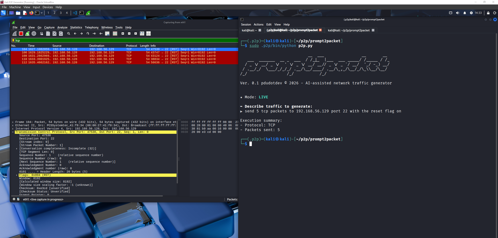
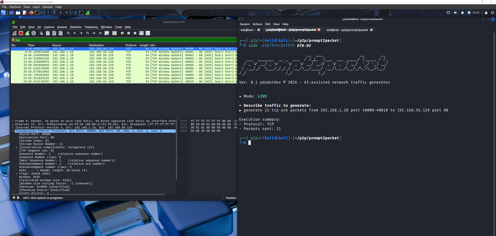
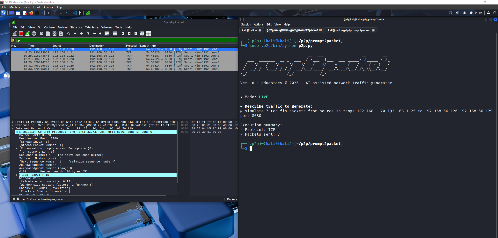
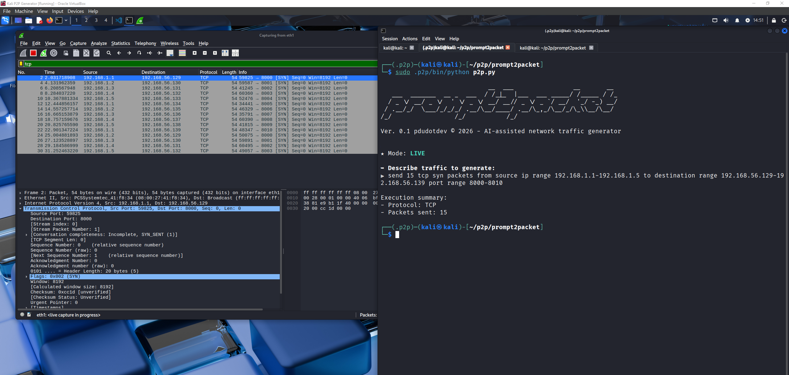
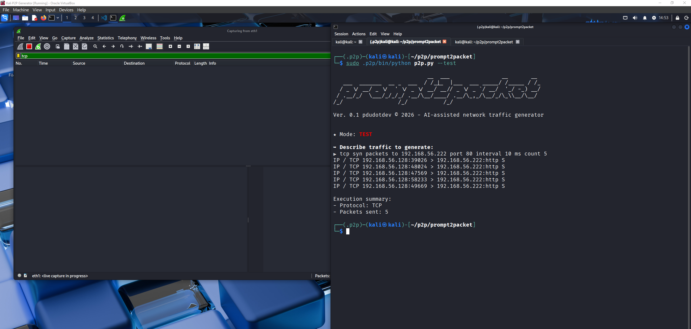
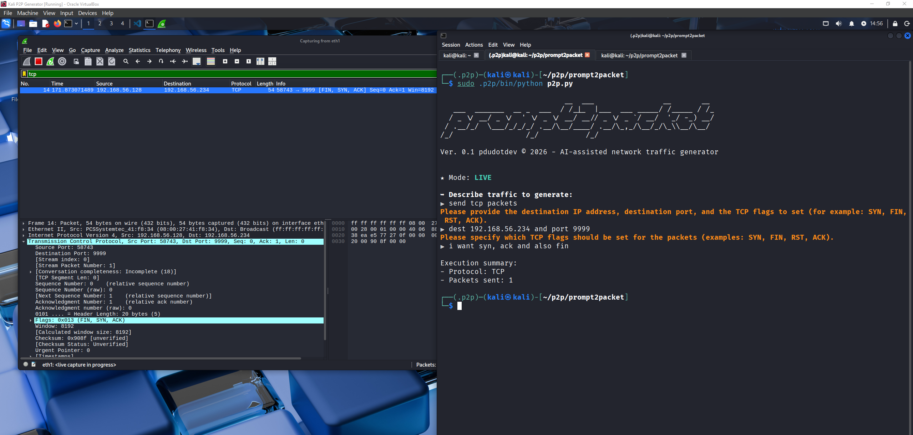

# prompt2packet
AI-assisted network traffic generator written in Python. Transforms user prompt into packets being sent on the wire. Useful for QA testing, pentesting, or educational purposes.

You can find more details about the first version of this tool in this [LinkedIn article](https://www.linkedin.com/in/tmihaicatalin/).

⚠️ **Note:** This application is still under test currently and more features are being added gradually.

## Installation

I've tested this application on **Kali Linux** only thus far, but it should work similarly on other Linux distros such as Ubuntu.

Prerequisites:
- Download VirtualBox from [here](https://www.virtualbox.org/wiki/Downloads)
- Download Kali Linux VM from [here](https://www.kali.org/get-kali/#kali-virtual-machines)
- Import your Kali VM into VirtualBox; also create a clone
- Make sure to enable a Host-Only adapter on each VM
- Get an OpenAI API key from [here](https://platform.openai.com/)
- The app runs on GPT5-mini, which is very cheap

Now, on your primary Kali VM:

```
sudo apt update && sude apt upgrade -y
mkdir p2p
cd p2p
git clone https://github.com/pdudotdev/prompt2packet.git
cd prompt2packet
python3 -m venv .p2p
source .p2p/bin/activate
pip install -r requirements.txt
```

Important!
- Create a `.env` file in your application's root folder:
```
cd prompt2packet
touch .env
```
- Add your API key here:
```
OPENAI_API_KEY=sk-...
```

Running prompt2packet:
- You can run prompt2packet either in **LIVE** or in **TEST** mode.
- LIVE mode actually sends the packets in the network
`sudo .p2p/bin/python p2p.py`
- TEST mode just prints the packets to the terminal
`sudo .p2p/bin/python p2p.py --test`

## Example of Prompts for Packet Generation

Below you can see some **prompt samples** that you can use to generate network traffic.

- **LIVE MODE**:
`send 5 tcp packets to 192.168.56.129 port 22 with the reset flag on`


`generate 11 tcp ack packets from 192.168.1.10 port 40000-40010 to 192.168.56.129 port 80`


`send 6 tcp packets from source ports in range 40000-40020 to host 192.168.56.129 port 8888 syn`


`simulate 7 tcp fin packets from source ip range 192.168.1.20-192.168.1.25 to 192.168.56.120-192.168.56.129 port 8080`


`send 15 tcp syn packets from source ip range 192.168.1.1-192.168.1.5 to destination range 192.168.56.129-192.168.56.139 port range 8000-8010`


- **TEST MODE**:
`tcp syn packets to 192.168.56.222 port 80 interval 10 ms count 5`


⚠️ **Note:** In its current form, prompt2packet uses Scapy's **send()** function to send Layer 3 packets in the network. This means that the destination IP address(es) must be on the same subnet as an existing interface of the Kali VM, since by default Scapy relies on the kernel routing table to route packets out the correct interface.

- **CLARIFICATION FEATURE**:
In prompt2packet, for each protocol there are some pre-defined **mandatory fields** that must be specified in the prompt, whilst other fields are optional.
If the user fails to specify one or more mandatory fields in the prompt, the AI engine will ask one or several clarification questions until it collects everything it needs.

For example, for TCP the mandatory fields are:
- Destination IP
- Destination port
- Flag(s)

... and the optional fields are:
- Source IP
- Source port
- Seq. number
- Window size
- TTL (Time To Live)
- Number of packets
- Interval between packets

Notice the clarification prompts below. Also note that since I haven't specified any number of packets to be sent - and since it's not a mandatory field - the application defaulted to 1.


**Note:** You can find more supported prompt types under `tests/` directory.

## Example of End-to-End Logical Flow

This section explains **exactly what prompt2packet does** when a user enters a prompt, let's say:

`send 10 tcp syn packets to port 9999`

This walkthrough lists **each step in order**, **which module is involved**, and **why it is called**.

### 🔸 1. Application entry point - p2p.py

**Purpose of this module:**  
p2p.py is the orchestrator. It coordinates the entire application.

What happens:
- Banner is displayed
- Root privileges are checked
- CLI arguments are parsed (e.g. --test)
- The user is prompted for input

The raw user input string is captured:

`send 10 tcp syn packets to port 9999`

p2p.py then passes this string to the AI interpreter.

### 🔸 2. Natural language parsing - ai/interpreter.py

**Purpose of this module:**  
To translate human language into structured data without guessing.

What happens:
- The AI receives the user text
- It produces a best-effort JSON object
- Required fields that are not explicitly mentioned are omitted

Typical AI output:
```
{
  "protocol": "tcp",
  "count": 10,
  "dst_port": 9999,
  "flags": ["SYN"]
}
```
This JSON is returned to p2p.py.

**Keep in mind!** No validation happens here.

### 🔸 3. Protocol dispatch - p2p.py & registry.py

**Purpose of this step:**  
To determine which schema applies in this case.

What happens:
- p2p.py reads `intent_data["protocol"]`
- Using **registry.py**, it maps `tcp` -> TCPIntent schema
- The application now knows which schema defines correctness

### 🔸 4. Schema validation (first pass) - schemas/tcp.py

**Purpose of this module:**  
Schemas define what fields are mandatory and which are optional.

For the **TCPIntent** schema, required fields include:
- protocol
- dst_ip
- dst_port
- flags

At this point, `dst_ip` is missing.

Pydantic raises a *ValidationError* indicating missing required fields.

### 🔸 5. Clarification loop - p2p.py

**Let's clarify the clarification step:**  
Missing information should be requested, **not** guessed.

What happens:
- p2p.py inspects the ValidationError
- It extracts missing required fields (in this case, `dst_ip`)
- It asks the AI engine to ask a polite clarification question

User sees something like:

`Please provide the destination IP address.`

Execution pauses until the user responds.

### 🔸 6. User clarification → AI again - ai/interpreter.py

User replies:

`192.168.56.129`

The AI converts this response into structured JSON:
```
{
  "dst_ip": "192.168.56.129"
}
```
Then, p2p.py merges this into the existing intent data.

### 🔸 7. Schema validation (second pass) - schemas/tcp.py

**Why validation runs again:**  
Every clarification response must still be validated.

Now all required fields are present:
- protocol
- dst_ip
- dst_port
- flags

Validation succeeds.

### 🔸 8. Semantic validation - validation/rules.py

**Purpose of this module:**  
Some rules cannot be expressed in schemas alone.

Examples:
- Packet count limits

In this case:
- count = 10

No semantic violations occur. Good, let's move on.

### 🔸 9. Execution planning - planner/execution.py

**Purpose of this module:**  
To separate intent from execution mechanics.

A deterministic execution plan is built containing:
- protocol
- packet template
- count
- interval

Example plan structure:
```
{
  "protocol": "tcp",
  "template": {
    "dst_ip": "192.168.56.129",
    "dst_port": 9999,
    "flags": ["SYN"],
    "src_port": "random"
  },
  "count": 10,
  "interval_ms": 0
}
```
### 🔸 10. Packet sending loop - sender/transmit.py

**Purpose of this module:**  
To control execution and iteration.

What happens:
- The correct packet builder is selected via **registry.py**
- A loop runs `count` times (10, here)
- For each iteration, a packet is built and sent (or printed in test mode)

### 🔸 11. Packet construction - packet/tcp.py

**Purpose of this module:**  
To convert intent fields into real packets.

For each packet:
- IP header is constructed
- Destination IP is applied
- Source port is selected
- TCP flags are mapped (`SYN` to `S`)
- A complete TCP packet is returned

This module just assembles the packet.

### 🔸 12. Wire execution - sender/transmit.py

**Purpose:**
To place the packet on the wire (or display it).

Depending on mode:
- **LIVE** mode: packets are sent with Scapy
- **TEST** mode: a packet summary is printed

The sender keeps track of how many packets were processed.

### 🔸 13. Result summary - observe/explain.py

**Purpose of this module:**  
To give clear human feedback.

Example output:
```
Execution summary:
- Protocol: TCP
- Packets sent: 10
- Mode: LIVE
```

### 🔸 Full application logical flow 
┌──────────────────────┐
│        User          │
│  Natural language    │
└─────────┬────────────┘
          │
          ▼
┌──────────────────────┐
│      p2p.py          │
│  App orchestrator    │
│  - banner / args     │
│  - root check        │
└─────────┬────────────┘
          │
          ▼
┌──────────────────────┐
│ ai/interpreter.py    │
│  Best-effort intent  │
│  NL → partial JSON   │
└─────────┬────────────┘
          │
          ▼
┌──────────────────────┐
│  Schema validation   │
│  (schemas/*.py)      │
│  Required fields?    │
└───────┬───────┬──────┘
        │       │
        │       │ ValidationError (missing fields)
        │       ▼
        │  ┌──────────────────────┐
        │  │ ai/interpreter.py    │
        │  │ Clarification        │
        │  │ question phrasing    │
        │  └─────────┬────────────┘
        │            │
        │            ▼
        │     ┌───────────────┐
        │     │     User      │
        │     │ clarification │
        │     └───────┬───────┘
        │             │
        └─────────────┘
          (loop until complete)
          │
          ▼
┌──────────────────────┐
│ validation/rules.py  │
│ Semantic / safety    │
│ checks & warnings    │
└─────────┬────────────┘
          │
          ▼
┌──────────────────────┐
│ planner/execution.py │
│ Build execution plan │
└─────────┬────────────┘
          │
          ▼
┌──────────────────────┐
│ sender/transmit.py   │
│ Execution loop       │
│ (count iterations)   │
└─────────┬────────────┘
          │
          ▼
┌──────────────────────┐
│ packet/*             │
│ Packet construction  │
│ (TCP / UDP builders) │
└─────────┬────────────┘
          │
          ▼
┌──────────────────────┐
│ sender/transmit.py   │
│ Send or print packet │
└─────────┬────────────┘
          │
          ▼
┌──────────────────────┐
│ observe/explain.py   │
│ Execution summary    │
└──────────────────────┘

